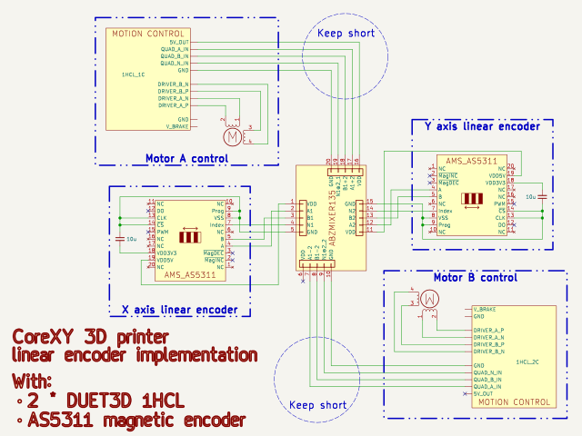
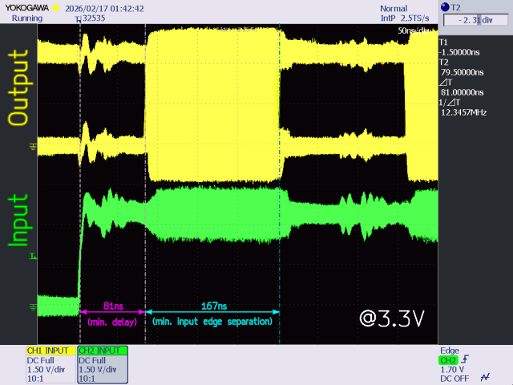
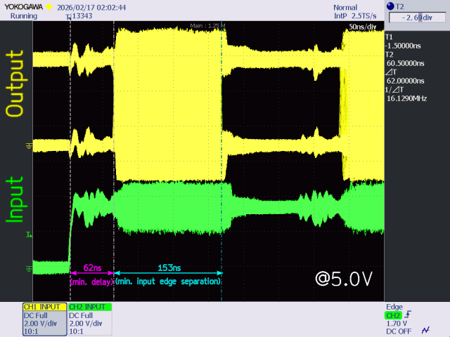
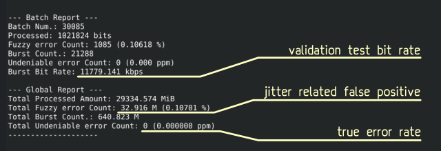

# [Hardware Quadrature Signal Mixer](https://www.tindie.com/stores/rowdy_npc)
*Enables No-Overhead Direct Axis Position Feedback for Closed-Loop Differential Drive Kinematics (Core XY, Robot wrist / ankle joints, etc.)*  
*... or you may desire to add and subtract whatever pairs of 2-bit incremental gray code signals at up to 12 Mbps ...* 😊

# Your CoreXY doesn't have to compromise on accuracy, nor speed!

Mount linear encoders on the **physical X/Y axes**, mix signals in pure hardware, and feed perfect motor\-domain A/B feedback to your controller.  
No firmware hacks, no CPU overhead, no more VFAs!

# What It Does

This compact hardware module mixes two independent ABZ quadrature encoder signals (e.g., linear X and Y) in real time:

- **OUT1** = X \+ Y → pure Motor A equivalent  
- **OUT2** = X \- Y → pure Motor B equivalent  
- **Z\_out** = Z\_x XOR Z\_y → for your convenience  

Plug your axis encoders in → get the clean, low\-latency ABZ signals your motion controller expects.

# Key Benefits

- Enables **true closed\-loop with linear encoders** on Duet 1HCL and similar boards  
- Zero software latency, propagation delay as low as **62 ns @ 5.0 V**  
- Up to **12.0 Mbps output bandwidth** (frees up to 35+ MIPS in the high\-speed control loops)  
- Plug\-and\-play: no firmware mods, standard TTL quadrature compatible  
- Built\-in ACTIVITY LEDs give instant visual feedback (1 blink = 1 step)  
- Wide voltage range: 3.3 ±0.3 V ~ 5.0 V ±0.5 V (<100 mA)

# The Core Problem: Domain Mismatch in Differential Kinematics

Most motion controllers (Duet3 1HCL, ODrive, many industrial servos) expect encoder feedback to match each motor's rotation. In CoreXY and differential\-drive systems, this creates issues:

- **Motor\-mounted rotary encoders** give precise motor angles but can't correct downstream errors (belt stretch/slip, pulley eccentricity, backlash, torsion, stiction, bearing play). This leads to artifacts like ringing, Vertical Fine Artifacts (VFAs), and dimensional inaccuracies, even in closed\-loop mode.  
- **Linear encoders on the X/Y axes** deliver true effector position (ideal for accuracy), but popular controllers usually have only one ABZ encoder input per motor, or require software to fuse X and Y into A/B (adding latency, CPU load, and needing dual ABZ inputs in hardware).  

**Result:** You sacrifice true positional accuracy or fight hardware/firmware limitations and performance penalties.

**The fix is hardware\-level mixing**, transforming linear X/Y feedback into motor\-domain A = X\+Y and B = X\-Y signals, so your existing controller sees exactly what it wants, with zero software involved.

# Killer Features

## *　1) Ultra\-Simple Setup*

Standard kit includes all crimp connectors.  
Works out of the box with most quadrature encoders.

## *　2) No CPU Overhead, Minimal Latency*

Hardware\-only processing eliminates software sensor fusion delays.  
Lab tested up to full spec ー see scope traces below.

## *　3) "Fake" Cartesian Mode (Controller Agnosticism)*

Trick industrial servo drives and single\-encoder\-per\-axis controllers into thinking they’re driving a standard Cartesian stage: perfect for retrofitting CoreXY mechanics!

# Applications

- CoreXY 3D printers with linear encoders (Voron, RatRig, etc.)  
- Differential drive robot wrists / joints (geared, timing belts, capstan, etc.)  
- Any coupled kinematic system needing sum / difference feedback  

# Specifications

| Parameter                             | Value                                              |
|---------------------------------------|----------------------------------------------------|
| Absolute Min. / Max. Supply Voltage   | \-0.5 ~ 7.0 V                                      |
| Operating Voltage (Vdd)               | 3.3 V ~ 5.0 V ±0.5 V (<100 mA)                     |
| Min. Propagation Delay                | 62 ns @ 5.0 V / 81 ns @ 3.3 V                      |
| Min. Output Edge Separation           | 62 ns (18.0 MS/s minimum recommended sampling rate)|
| Max. Error-free Bitrate\* **per input**    | 6.0 Mbps (185ns minimum recommended input edge separation)   |
| Output Type                           | Single\-ended TTL push\-pull (<9 mA, 50~65 Ohm)      |
| Inputs                                | Single\-ended TTL (10 kΩ internal pull\-up to VDD)   |
| Z Output                              | XOR of Z\_x and Z\_y                                 |
| Included                              | 4 × CDH\-05 5\-pin plugs \+ 20× CDH\-C crimp contacts  |

*\*Error rate < 0.001 ppm*

# Important Warnings & Recommendations

- Sold as\-is for integration (sub\-component), no warranty  
- Do not exceed ratings  
- Inputs are unprotected / unterminated  
- All I/O share common GND / VDD net (beware ground loops & parallel PSUs)  
- Recommended Input bit-rate: <90% of Max. Error-free Input Rate
- Controller must support the Min Output Edge Separation time even if the mixer is fed slower than Max Input Bitrate input streams  
- For best performance:

    - Use 5.0V supply voltage  
    - Ensure stable electrical supply  
    - Keep the leads as short as possible, especially between the mixer and the controller  

# Performance assessment

Each sold unit is individually tested for error\-free processing of at least 1 Gib of data simultaneously streamed to both ABZ inputs of the mixer at 95% of the Max. Error-free input Bitate at 3.3V.

[")](./media/3.3VOutEdgeSeparation-02.png)

THANK YOU! For supporting a small hardware maker! 🚀

